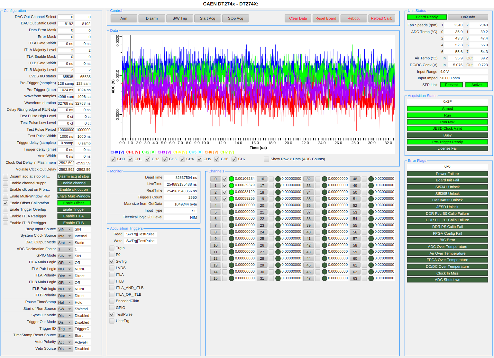

# caenDigitizer IOC

An EPICS IOC for DT274x CAEN Digitizers. Tested on Linux with a CAEN DT2745B.



## Dependencies

This IOC depends on a couple of CAEN libraries:

```bash
mkdir ~/tmp
cd ~/tmp
git clone https://github.com/caenspa/caen-felib
cd caen-felib
git checkout v1.3.2 # check if there are more recent versions
git checkout -b v1.3.2
./configure --disable-assert --enable-static
make
sudo make install
sudo ldconfig

cd ~/tmp
git clone https://github.com/caenspa/caen-dig2
cd caen-dig2
git checkout v1.3.2 # check if there are more recent versions
git checkout -b v1.3.2
./configure --disable-assert --enable-static
make
sudo make install
sudo ldconfig

```
